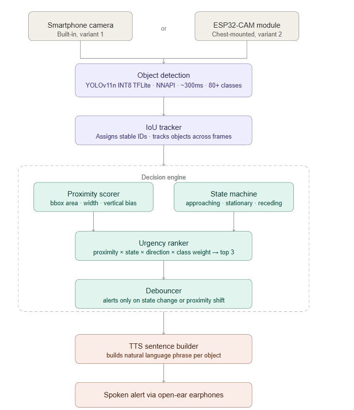

# SoundSense
> Real-time offline spatial awareness for visually impaired navigation.

A real-time, offline navigation assistant designed to enhance spatial awareness for visually impaired users using computer vision and audio feedback.

---

## Overview

SoundSense is a lightweight assistive system that detects nearby objects, understands their position and motion, and communicates this through concise spoken feedback.

It is designed to **complement**, not replace, traditional tools like the white cane by providing **early awareness of surroundings**.

---

## App Variants

### Navigation Assistant
- Uses the **phone's built-in camera**
- Works **completely offline** — no internet or subscriptions
- No additional hardware required
- Best for everyday, lightweight use

### Navigation Hardware
- Connects to an **external camera module** (e.g., ESP32-CAM) over HTTP
- Requires an HTTP stream URL where frames are being served by the camera module
- Enables hands-free, wearable setups — camera mounted on glasses or a chest harness
- Ideal for users who want a dedicated, purpose-built navigation rig

---
## Why SoundSense?

A white cane is effective for immediate obstacles, but it has limitations:

- It cannot detect objects at a distance  
- It cannot indicate motion (approaching / receding)  
- It provides no directional context beyond contact  

SoundSense addresses these gaps by offering:

- **Distance awareness (approximate)**
- **Directional guidance (left / right / ahead)**
- **Motion awareness (getting closer / getting farther)**

---

## Accessibility & Cost

- **Low-cost solution** — runs on a standard smartphone  
- **No specialized hardware required**  (for navigation assistant)
- **Fully offline** — no internet or subscriptions  
- **Free to use**

For best results:
- Use **open-ear earphones** to preserve environmental awareness  
- If unavailable, standard earphones can be used cautiously  

---

## Features

- **Fully Offline Processing**
- **Real-time Object Detection (YOLO - TFLite)**
- **IoU-based Object Tracking**
- **Motion Detection**
  - approaching / receding / stationary
- **Spatial Reasoning**
  - left / right / center positioning
- **Priority-based Alerts**
  - only the most relevant objects are announced
- **Debounced Audio Output**
  - avoids repetitive or noisy feedback
- **Optimized for Mobile Devices**

---

## Example Output

- “on your left, car, getting closer”  
- “ahead, person”  
- “far to your right, 2 bicycles”  

---

## Screenshots & Demo

👉 [Demo Video](https://drive.google.com/file/d/19LFLPK85_ZRjSWaNO_Xgi68vL8RWPZwP/view?usp=sharing)

<p align="center">
  </br>
  
  
  
</p>

---

## System Architecture

<p align="center">
  
</p>
---

## Hardware Setup (Optional)

### Navigation Assistant (No Hardware Required)
- Smartphone camera only
- Install the APK and you're ready to go

### Navigation Hardware (External Camera)
- Requires a camera module that streams frames over HTTP (e.g., ESP32-CAM)
- Enter the HTTP stream URL in the app to connect
- Camera can be mounted on:
  - glasses
  - chest harness
- Audio output via:
  - open-ear earphones (recommended)
  - standard earphones

---

## Android App

Download and install the app:

👉 [Download APK](https://drive.google.com/drive/folders/1wt31oQWiCdHcGw8nMxsauFqa6959WHdn?usp=sharing)

- **Navigation Assistant** — open the app and start immediately  
- **Navigation Hardware** — open the app, enter your camera module's HTTP stream URL, and connect 

---

## Developer Information

### Flutter App
- Built with Flutter (Android Studio)
- Uses `ultralytics_yolo` plugin
- Model: YOLO TFLite (`.tflite`)

### Python Version
A reference implementation of the pipeline is included for experimentation:

```bash
python object_detection_endpoint.py
```
> The primary focus of this repository is end-user usage, with a reference Python implementation provided for experimentation.

---

## Design Principles
- Offline-first
- Low latency
- Signal over noise
- Deterministic decision-making (no cloud AI / LLMs)

---

## Limitations
- Performance varies by device
- No true depth sensing (distance is estimated)
- Fast motion can affect tracking stability
- Detection accuracy depends on the model

---

## Future Improvements
- UX and audio refinement
- Improved tracking robustness
- Depth estimation integration

---

## Disclaimer

SoundSense is an assistive tool and should not replace primary navigation aids such as a white cane.

---

## License

MIT License

---

## Author

Rohit Bangar

[LinkedIn Profile](https://www.linkedin.com/in/rohit-bangar-24b174305/)
